# **1. Obiectivul aplicației**
`	`Obiectivul principal al aplicației reprezintă memorarea filmelor ce urmează a fi văzute si a celor deja văzute, prin adăugare manuala sau căutare într-o baza de date pusa la dispoziție de un furnizor.

# **2. Structura aplicației**

<h2>2.1. Pachetul adapters</h2>

Acest pachet conține toate adaptoarele din aplicație utilizate atât pentru ListView cat si pentru RecyclerView.

<h2>2.2. Pachetul data_access</h2>

Conține:

- Interfețele Dao (Data Access Object) pentru biblioteca Room (utilizate pentru accesul la datele stocate in baza de date locala)

- Clasa AppDatabase care extinde RoomDatabase si ajuta la implementarea arhitecturii „Singleton” pentru baza de date.

- Clasa AppExecutors care încapsulează un obiect de tip Executor folosit pentru a accesa baza de date asincron.

- Clasa AppData care definește implementarea concreta a accesului la date (Room si Firebase) si stochează filmele favorite pe tot parcursul rulării aplicației.

<h2>2.3. Pachetul fetchers</h2>

Conține clase derivate din AsyncTask care ajuta la comunicarea cu API-ul si o clasa ajutătoare pentru citirea formatului JSON.

<h2>2.4. Pachetul fragments</h2>

Conține fragmentele folosite in aplicație (in MainActivity)

<h2>2.5. Pachetul models</h2>

Conține clasele corespunzătoare tuturor entităților folosite in cadrul aplicației

<h2>2.6. Pachetul principal (com.marius.movies)</h2>

Conține, pe lângă celelalte pachete, toate activitățile aplicației.

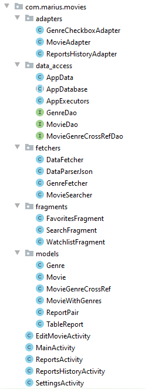

# **3. Modul de utilizare al aplicației**
## 3.1. Căutarea de filme
`	`Dupa introducerea textului dorit se apasa tasta enter sau butonul de cautare si vor aparea rezultate puse la duspozitie de TMDB.com

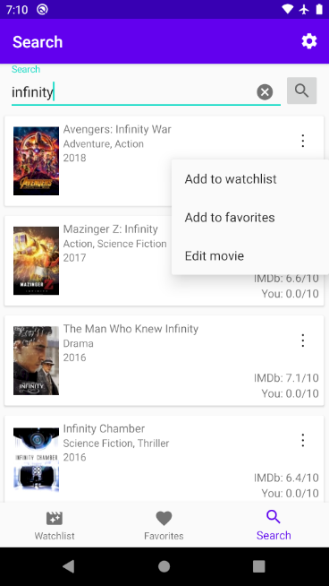

Figura 1

`	`Filmele din lista pot fi adaugate la Watchlist (filme de vizionat) sau la Favorite sau pot fi editate inainte de adaugare

## 3.2. Editarea unui film deja existent
`	`Pentru editarea unui film apasam pe butonul „Edit movie” care ne duce intr-o activitate noua in care putem edita detaliile filmului sau putem sa ii dam un rating:

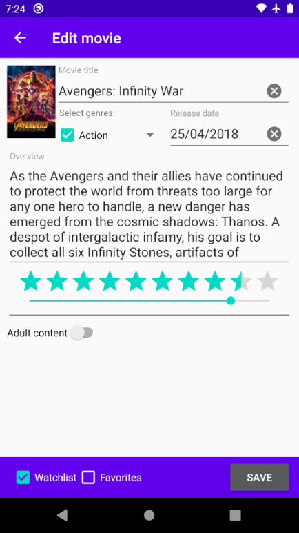

Figura 2

`	`Se poate adauga sau schimba imaginea filumului apasand pe aceasta. Bara de rating reprezintă doar ratingul personal (cel oficial nu poate fi schimbat) iar dropdown-ul de selectie al genurilor se deschide apasand sageata din dreapta acesstuia:

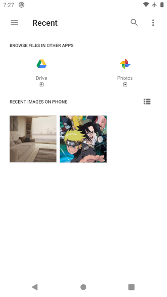      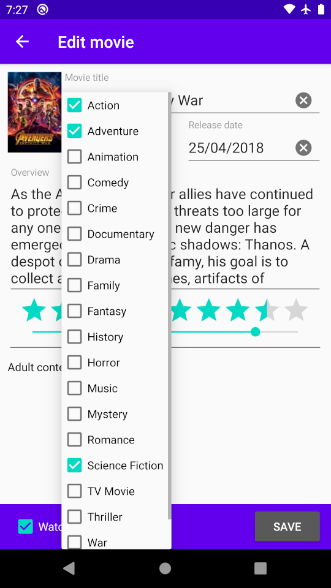

`			`Figura 3					Figura 4

Inainte de a salva filmul trebuie sa bifam in ce locatii sa fie salvat (Watchlist si Favorites), dupa care acesta va fi introdus in baza de date locala.

## 3.3. Lista Watchlist/Favorites
`	`Cu ajutorul butoanelor din partea de jos a ecranului (Figura 5) putem naviga intre cele 3 fragmente definite la nivelul aplicatiei. Cele 2 fragmente cu liste de filme salvate in baza de date aduc in plus, fata de fragmentul Search, 3 optiuni in bara din partea de sus a aplicatiei (Figura 5), dintre care doar una este vizibila (cea de adaugare manuala a unui film).

`	`Fiecare film din lista are o optiune de editare, una de stergere si una de mutare in cealalta lista (Figura 5).

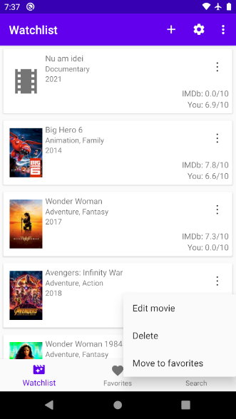        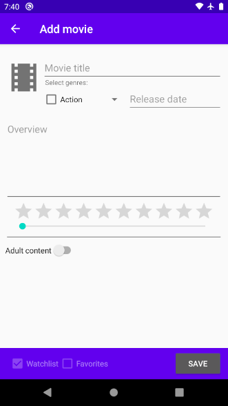

Figura 5					Figura 6

`	`Daca apasam pe butonul de adaugare din partea de sus (Figura 5) se va deschide activitatea de adaugare manuala a unui film nou (Figura 6).

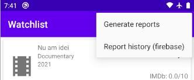

Figura 7
## 3.4. Generare si salvare de rapoarte
`	`Optiunea „Generate reports” va deschide o activitate care contine 2 rapoarte (Figura 8):

- Un raport care descrie impartirea filmelor pe intervale de rating din 1 in 1 folosind un grafic de tip placinta
- Un raport care prezinta numarul filmelor din cele 2 liste si media scorurilor acestora. In plus arata si totalul filmelor impreuna cu media scorurilor per total folosind o medie aritmetica ponderata

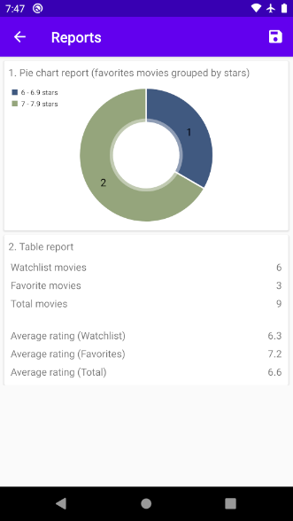    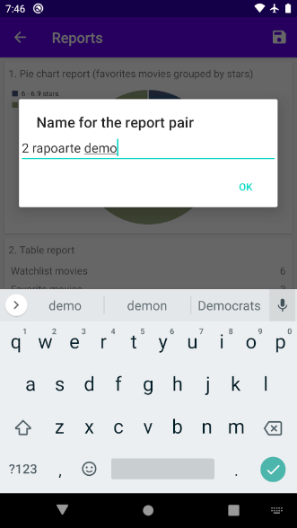

`  `Figura 8					   Figura 9

Apasand pe butonul de salvare din partea de sus (Figura 8), ni se va cere un nume pentru perechea  de rapoarte pentru ca aceasta sa fie salvata in firebase.

Putem vizualiza lista completa accesand „Report history” (Figura 7):

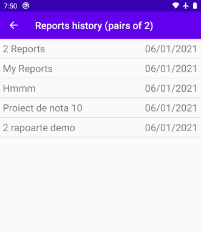

Figura 10

`	`Putem apasa pe oricare dintre aceste perechi iar aplicatia va deschide o activitate care ne va permite sa vizualizam cele 2 rapoarte salvate la momentul respectiv. Putem sterge o pereche de rapoarte prin apasarea butonului de stergere din partea de sus (Figura 11).

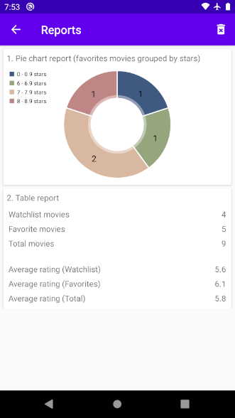

Figura 11
## 3.5. Configurarea aplicatiei
`	`Din oricare dintre fragmentele amintite mai sus, putem accesa optiunea de setari, care va deschide o activitate cu cele 3 setari posibile ale aplicatiei.

- Optiunea de „Startup page” seteaza ce fragment sa se deschida la pornirea aplicatiei
- Optiunea „Number of genres displayed” seteaza numarul de genuri care sa fie afisat in liste (Figura 5)
- Optiunea „Include adult movies” seteaza daca sa se afiseze filme care sunt restrictionate copiilor sub 18 ani sau nu in rezultatele cautarilor.

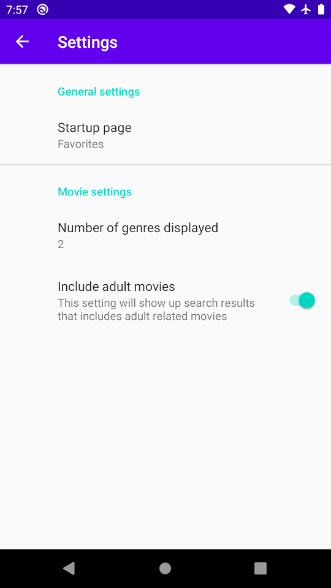

Figura 12

